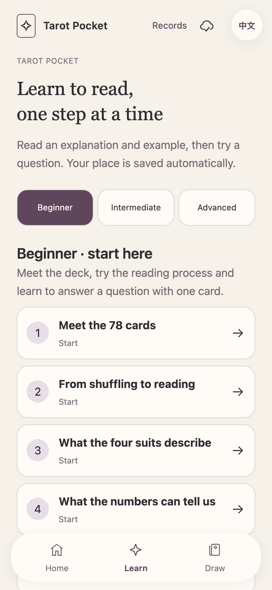
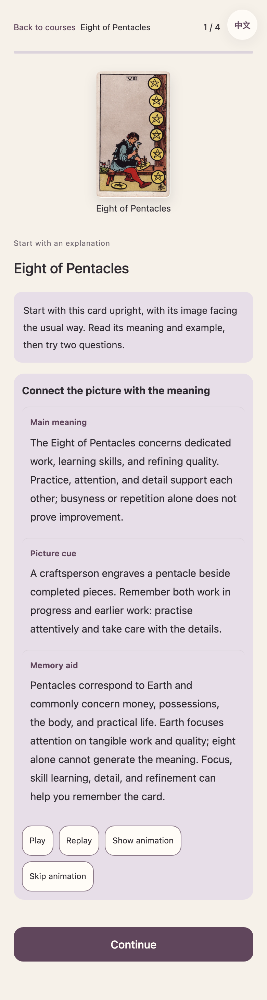
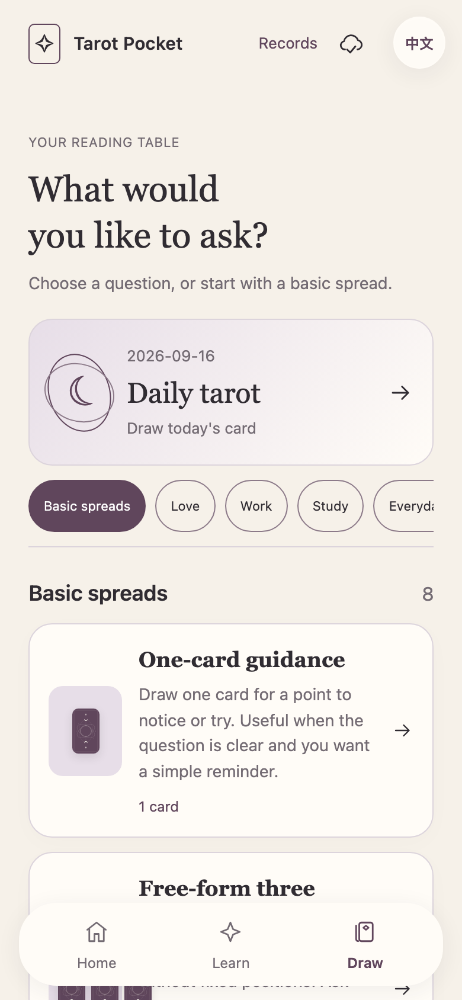
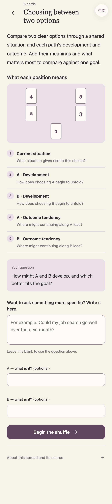
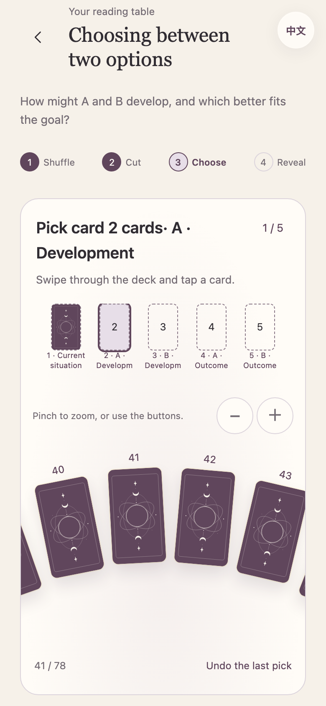
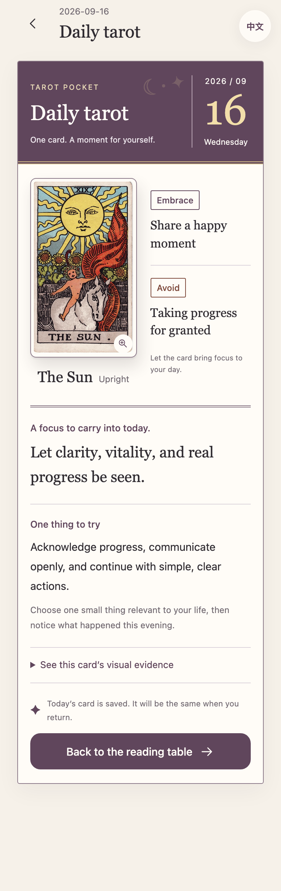

# Tarot Pocket · 塔罗随身学

**Learn tarot from the beginning, or draw cards for a question on your mind.**

The v1.9 public product is intentionally Chinese-only while its beginner curriculum and reading quality are being consolidated. English source notes and legacy translations remain in the repository, but there is no English entry in this release.

[**Try the Chinese release →**](https://tarot.georgelu.cn/) · [**Offline edition**](https://github.com/georgelu-creator/tarot-pocket/releases) · [简体中文](README.zh-CN.md)


## Learn one step at a time

Twenty lessons cover eight beginner, six intermediate and six advanced topics. A separate 78-card library opens the individual lessons without turning the course page into one long catalog. Every card shows its core meaning, picture clue and memory link before the first question. Wrong answers receive specific feedback and another example; persistent difficulty leads to a recap and a later revisit.

Start each card upright, apply it in a situation, then explore reversals. Follow the courses, choose a card, or learn a random new one. Card images keep a consistent size and position. There are no self-ratings, required reflections, voice tasks or playback controls. Explanations, examples and practice appear directly.



## Find the question you want answered

Twenty-five entries are grouped into basics, love, work, study and life. Start with one card or an open three-card reading, or choose Yes/No, two or three choices, relationships, reunion, job search or exams. Each entry explains when to use it and what it answers. The introduction shows the whole spread and every position together.

Use the preset question directly or add details. Shuffle, cut and select on one continuous table. Swipe through all 78 backs, zoom, and tap once to choose. Reversals are included by default and the group reveals together.



Revealing the group first produces a local interpretation of the question, spread, positions and orientations. Yes/No does not vote by orientation, open three cards do not invent hidden roles, and choice readings compare every option on the same goal. Online AI remains a separate, explicit action. Waiting is cancellable; retries keep the same cards. An old reply cannot overwrite a newly edited question.

Completed answers save locally. Card details and spread information return to the same reading. Offline drawing, card references and saved answers remain available; offline references are never labeled as AI answers.

## A card for today

The daily calendar highlights the saved date, complete artwork, card meaning and advice, with orientation-specific Embrace/Avoid reminders. The same day keeps the same card, and earlier days remain accessible. No sharing or streak task is required. These are card-inspired reminders, not traditional almanac predictions.



## Mobile, Chinese-only and offline

- The hosted product opens directly. Learning, drawing cards and the local spread-aware reading need no account or invitation.
- Online AI is requested only after the reader presses the separate deep-reading button. Provider credentials remain on the server, and a connection failure does not remove the local answer, cards or question.
- In Records, download and verify offline content, then use Safari’s Add to Home Screen. Test offline use on your own phone before travelling.
- The current public interface is Chinese-only. Stable IDs, older records and the verified historical RWS artwork remain compatible.
- Records stay in the current browser. Export JSON before changing devices. Older learning and reading backups remain supported. Use the update entry above without clearing site data.

[Learning master](docs/LEARNING_MASTER.md) · [Reading master](docs/READING_MASTER.md) · [Implementation and validation](docs/RELEASE_1_9.md)

Automated checks cover content, state recovery, the Chinese interface, responsive layouts and browser interaction. They do not establish long-term learning effectiveness or performance on every physical phone/network. Independent teacher review and beginner trials remain necessary.

## Run it locally

Use **Python 3.10+** and **Node.js 22+**. The source is plain HTML, CSS, and JavaScript; Python builds the standalone edition and Playwright checks the interactions.

```sh
git clone https://github.com/georgelu-creator/tarot-pocket.git
cd tarot-pocket
python3 -m venv .venv
source .venv/bin/activate
python -m pip install -r requirements-dev.txt
npm ci
npx playwright install chromium webkit
npm run build
npm run serve
```

Open [the local demo](http://127.0.0.1:8765/demo/tarot-demo.html). Run `npm test` for the repository's checks. Read [Development](docs/DEVELOPMENT.md) for the file layout and validation workflow, or [Handoff](docs/HANDOFF.md) to continue on another computer.

## Help make the next lesson better

The most useful feedback is concrete: **which card, which position, which answer, and what made you hesitate?** Use the app, then [report an experience issue](https://github.com/georgelu-creator/tarot-pocket/issues/new?template=bug.yml), [improve a lesson or translation](https://github.com/georgelu-creator/tarot-pocket/issues/new?template=learning-content.yml), or [propose a feature](https://github.com/georgelu-creator/tarot-pocket/issues/new?template=feature.yml).

Teachers, learners, translators, and accessibility testers are welcome. Read [Contributing](CONTRIBUTING.md) before opening a pull request. Please use invented examples instead of sharing private reading histories. If this approach is useful to you, a star helps others find the project.

## Artwork and licenses

The artwork is by **Pamela Colman Smith**, from the historical Rider–Waite–Smith **Pam-A** deck scanned in the [TaionWC collection on Wikimedia Commons](https://commons.wikimedia.org/wiki/Category:Rider-Waite-Smith_tarot_deck_(TaionWC)). The project preserves image identity, provenance, dimensions, and hashes; it does not mix in modern redraws or generated substitutes.

- **Application code and tooling:** [MIT](LICENSE).
- **Original lessons, translations, documentation, and the authored card back:** [CC BY-SA 4.0](CONTENT_LICENSE.md).
- **Historical card artwork:** separate [artwork rights notice](ARTWORK_LICENSE.md), [source notes](assets/SOURCES.md), and [per-card manifest](assets/manifest.json). Source pages identify these works as public domain; that status is separate from the code and content licenses.

Tarot Pocket is an independent learning project. [Changelog](CHANGELOG.md) · [Security](SECURITY.md) · [Community expectations](CODE_OF_CONDUCT.md)
