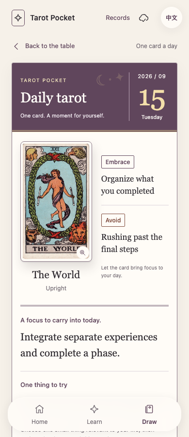
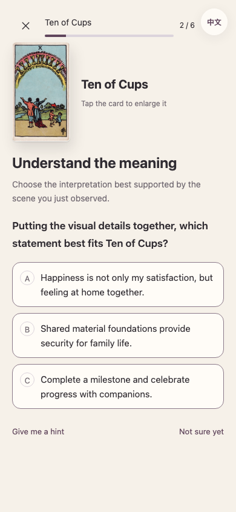
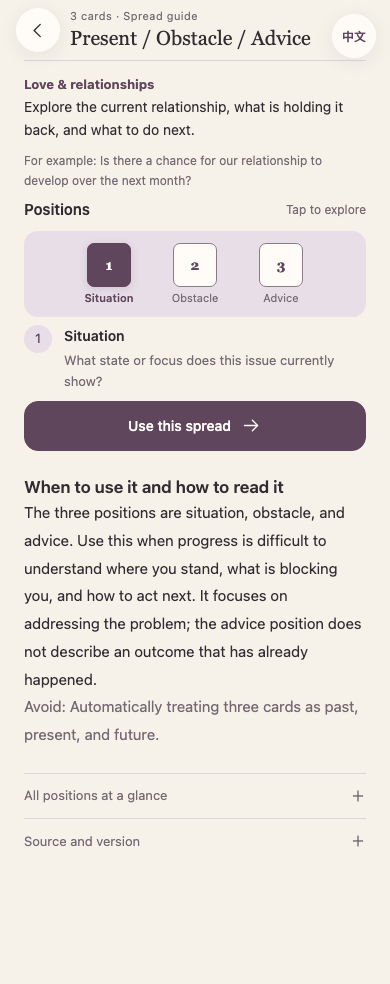
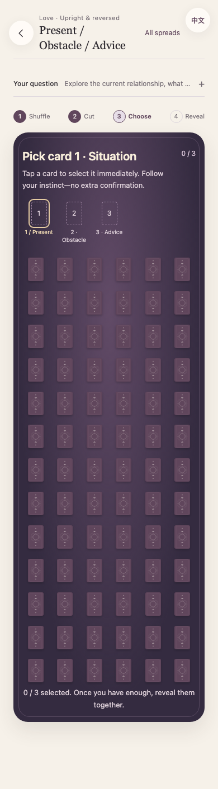
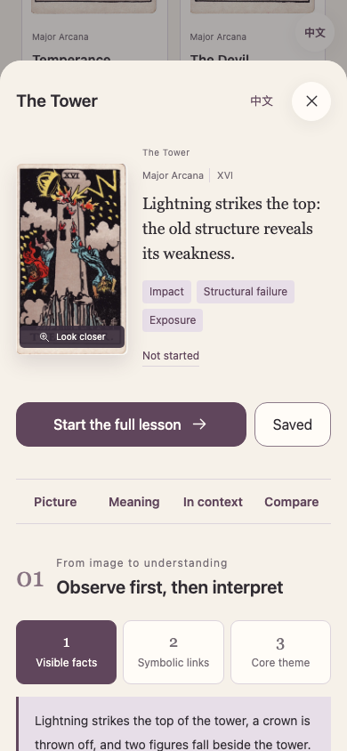
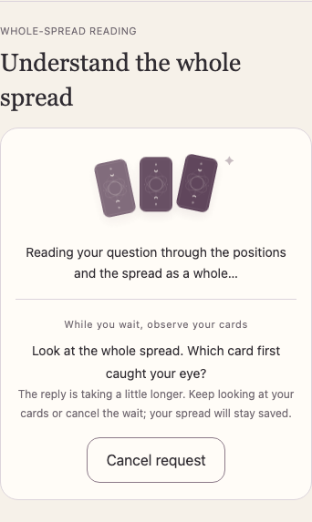

# Tarot Pocket · 塔罗随身学

**Learn to read the cards. Remember why they mean something.**

A bilingual, image-first tarot learning companion. Recall, compare, find evidence, and read a spread — with taps instead of typing. Take the complete 78-card deck and the current lessons with you in a single offline HTML file.

[**Start learning →**](https://georgelu-creator.github.io/tarot-pocket/?lang=en) · [**Download the offline edition**](https://github.com/georgelu-creator/tarot-pocket/releases/download/v1.6.0/tarot-pocket-v1.6.0.html) · [简体中文](README.zh-CN.md) · [Roadmap](docs/ROADMAP.md)


[](LICENSE)
[](CONTENT_LICENSE.md)

v1.6.0 provides **freely selectable, continuous learning for all 78 cards**, per-skill spaced review, and a separate pocket reading table. The hosted app uses one 8-character invitation entrance; after entry, AI readings connect automatically and center the user's actual question.

**Used an earlier version?** Open [Update while keeping records](https://georgelu-creator.github.io/tarot-pocket/update.html?lang=en), download the verified update, then choose to enter it. Do not clear site data.

This release focuses both core flows: fixed six-stage lessons with rewritten card-specific wording; all 78 backs in one continuous overview, immediate one-tap picks, and one action to reveal the group. Reversals are included by default. The selected category reaches AI, which answers the specific outcome with evidence first. Shuffle rituals and guided AI waits remain. [Experience and acceptance contract](docs/EXPERIENCE_V1_6.md).

## A moment for today

The daily card now opens as a dated calendar sheet: a prominent day and weekday, the complete card, and short **Embrace / Avoid** reminders for its upright or reversed meaning. Original card advice remains below, with optional visual evidence and a full reference. A gentle entrance respects reduced motion. Reopening the same day keeps the same card; past entries show their saved date. These are card-inspired reflections, not traditional almanac predictions. No sharing step is added.



## A small lesson that stays with you

A keyword flashcard might say “Four of Pentacles = holding on.” Tarot Pocket takes you through the picture: locate the hands and feet, recall the idea before seeing an answer, compare nearby meanings, connect Earth and Four, and try the card in a different position.

Questions with explicit criteria explain why the selected answer is wrong. For open position readings, form your own sentence before checking the reference and self-assessing. Final recall hides the picture and card-specific cues; requesting a cue records assisted recall.

Tap **Random new card** on Home to prioritize cards not yet started; **Resume** remains separate, or choose any card in **Learn**. Each card has six stages: observe, interpret, remember, apply, understand reversals, and recall. The card keeps a consistent position and size. First lessons require no unfamiliar-card comparison or written reflection. Choose what to learn next at completion; exiting preserves progress.



## What you can do now

| Experience | Current version |
| --- | --- |
| Learn from real artwork | 78 historical Rider–Waite–Smith cards from one Pam-A scan set, with individual sources and checksums |
| Practice beyond recognition | 78 six-stage card lessons, plus 56 further lesson steps and 24 earlier practice questions |
| Build a mental framework | Elements, numbers, visual evidence, same-card position changes, and contextual reversals |
| Learn how spreads work | 7 sourced spread structures, an open three-card mode and a daily draw, with compact guides and exact position definitions |
| Change the question | Love, career, and study contexts; the same card can play different roles |
| Draw without a physical deck | Optionally write a question, shuffle all 78 cards, cut the deck, browse a continuous overview, tap once to pick without replacement, and reveal the group; reversals are included by default |
| Review by performance | Five current skills follow SM-2 intervals; historical distinction records remain; immediate retries do not count as delayed recall |
| Keep your place | Local progress, a resumable card table, up to 40 saved readings, and JSON export/import |
| Switch language | English and Simplified Chinese interface and learning content |

Browse **love, work, study, life, self-reflection and choices**. Each spread displays its layout and every position before shuffling, cutting and drawing. A separate **daily tarot draw** keeps the same card when revisited that day.






## Built for a trip with patchy internet

The recommended phone entry is the public website:

1. Open [Tarot Pocket](https://georgelu-creator.github.io/tarot-pocket/?lang=en) in Safari.
2. Go to **Records → Check offline content and installation**, then download the complete offline content. Keep the page open until validation finishes.
3. In Safari’s Share menu, choose **Add to Home Screen**. Open the installed site and check its offline status again.
4. Before travel, test airplane mode, closing/reopening, an unfamiliar card, and saved progress on the actual phone.

Readiness reflects real download and inventory checks. Failed updates keep the previous complete release and do not force a reload during learning. A [single-file HTML edition](https://github.com/georgelu-creator/tarot-pocket/releases/download/v1.6.0/tarot-pocket-v1.6.0.html) remains available for browsers that support local JavaScript.

**Content and personal records are different.** Browsers can evict site data. Export JSON before switching devices or browsers. Git transfers source, never private questions or learning records. Learning and drawing need no account, external fonts or analytics. Optional AI interpretation sends only the current question and drawn cards to the configured service after an explicit request; provider keys remain server-side. See [AI service](docs/AI_SERVICE.md).

## Capabilities and limits

- All 78 cards have authored visual mnemonics, plain explanations, and three distinguishable choices within a complete shared learning flow.
- Records distinguish encounters, first lessons, self-ratings, objective application, and delayed reviews. Marking a card read never means mastery.
- Five current skills use SM-2 interval rules, with a 24-hour guard against repeated same-day promotion and immediate retries erasing a lapse. This is not FSRS, and product-specific long-term effectiveness is not claimed.
- Offline references are labeled as basic references. The optional DeepSeek/OpenAI service analyzes the written question and the whole spread; saved answers remain available offline. Quizzes do not interrupt readings. See [spread sources](docs/SPREAD_SOURCES.md).
- Content and translations still need independent tarot-teacher review. Automated checks do not replace expert review, physical iPhone tests, phone-restart tests, or extended offline travel. See [Handoff](docs/HANDOFF.md) for exact evidence.
- This release is an installable mobile website, not a native App Store application.

## Run it locally

Use **Python 3.10+** and **Node.js 22+**. The source is plain HTML, CSS, and JavaScript; Python builds the standalone edition and Playwright checks the interactions.

```sh
git clone https://github.com/georgelu-creator/tarot-pocket.git
cd tarot-pocket
python3 -m venv .venv
source .venv/bin/activate
python -m pip install -r requirements-dev.txt
npm ci
npx playwright install chromium webkit
npm run build
npm run serve
```

Open [the local demo](http://127.0.0.1:8765/demo/tarot-demo.html). Run `npm test` for the repository's checks. Read [Development](docs/DEVELOPMENT.md) for the file layout and validation workflow, or [Handoff](docs/HANDOFF.md) to continue on another computer.

## Help make the next lesson better

The most useful feedback is concrete: **which card, which position, which answer, and what made you hesitate?** Use the app, then [report an experience issue](https://github.com/georgelu-creator/tarot-pocket/issues/new?template=bug.yml), [improve a lesson or translation](https://github.com/georgelu-creator/tarot-pocket/issues/new?template=learning-content.yml), or [propose a feature](https://github.com/georgelu-creator/tarot-pocket/issues/new?template=feature.yml).

Teachers, learners, translators, and accessibility testers are welcome. Read [Contributing](CONTRIBUTING.md) before opening a pull request. Please use invented examples instead of sharing private reading histories. If this approach is useful to you, a star helps others find the project.

## Artwork and licenses

The artwork is by **Pamela Colman Smith**, from the historical Rider–Waite–Smith **Pam-A** deck scanned in the [TaionWC collection on Wikimedia Commons](https://commons.wikimedia.org/wiki/Category:Rider-Waite-Smith_tarot_deck_(TaionWC)). The project preserves image identity, provenance, dimensions, and hashes; it does not mix in modern redraws or generated substitutes.

- **Application code and tooling:** [MIT](LICENSE).
- **Original lessons, translations, documentation, and the authored card back:** [CC BY-SA 4.0](CONTENT_LICENSE.md).
- **Historical card artwork:** separate [artwork rights notice](ARTWORK_LICENSE.md), [source notes](assets/SOURCES.md), and [per-card manifest](assets/manifest.json). Source pages identify these works as public domain; that status is separate from the code and content licenses.

Tarot Pocket is an independent learning project. [Changelog](CHANGELOG.md) · [Security](SECURITY.md) · [Community expectations](CODE_OF_CONDUCT.md)
