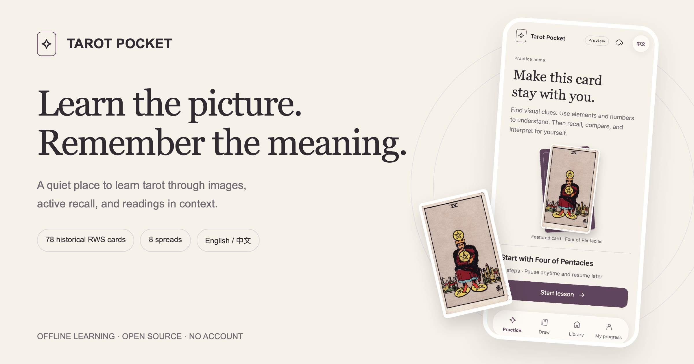
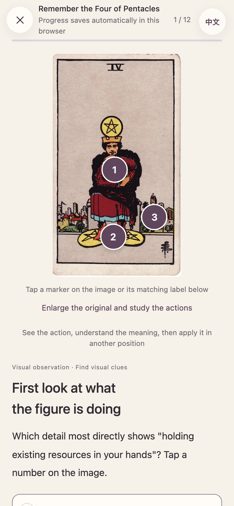
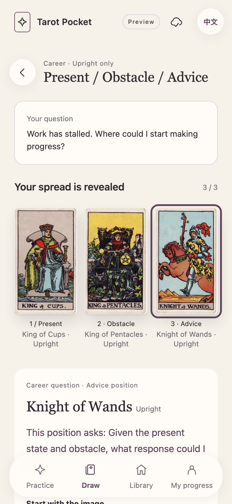

# Tarot Pocket · 塔罗随身学

**Learn to read the cards. Remember why they mean something.**

A bilingual, image-first tarot learning playground. Recall, compare, find evidence, and read a spread — with taps instead of typing. Take the complete 78-card deck and the current lessons with you in a single offline HTML file.

[**Try the demo →**](https://georgelu-creator.github.io/tarot-pocket/?lang=en) · [**Download the offline edition**](https://github.com/georgelu-creator/tarot-pocket/releases/download/v0.4.0/tarot-pocket-v0.4.0.html) · [简体中文](README.zh-CN.md) · [Roadmap](docs/ROADMAP.md)




[](LICENSE)
[](CONTENT_LICENSE.md)

The v0.4.0 preview brings a warm-white and plum design, quieter reading surfaces, a shared celestial card back, and focused drawing with skippable motion. The practice-first learning flow remains intact. See the [bilingual design contract](docs/design/README.md) for the reusable rules and the distinction between supplied concepts and implemented components.

## A small lesson that stays with you

A keyword flashcard might say “Four of Pentacles = holding on.” Tarot Pocket takes you through the picture: locate the hands and feet, recall the idea before seeing an answer, compare nearby meanings, connect Earth and Four, and try the card in a different position.

You choose both an interpretation and its evidence. Feedback tells you clearly when an answer is wrong and explains the difference. Quiet recall is recorded as self-assessment; an open reading is not graded as an objective prediction.

Start with **Practice → Four of Pentacles**. Its 12-step lesson is the best introduction to the product. Then visit the elements and numbers lab, build a three-card reading, and return to the same ideas in a new context.



## What you can do now

| Experience | In this preview |
| --- | --- |
| Learn from real artwork | 78 historical Rider–Waite–Smith cards from one Pam-A scan set, with individual sources and checksums |
| Practice beyond recognition | 56 learning steps across 8 units, plus 24 mixed practice questions |
| Build a mental framework | Elements, numbers, visual evidence, similar-card distinctions, position changes, and contextual reversals |
| Learn how spreads work | 8 spreads, their purpose, position questions, and practice identifying those positions |
| Change the question | Love, career, and study contexts; the same card can play different roles |
| Draw without a physical deck | Shuffle all 78 cards, pick without replacement, reveal cards, and optionally include reversals |
| Keep your place | Local progress, a resumable card table, up to 40 saved readings, and JSON export/import |
| Switch language | English and Simplified Chinese interface and learning content |

The eight spreads are **Single-card Focus**, **Situation–Obstacle–Advice**, **Past–Present–Trend**, **Two Paths**, **Relationship Awareness**, **Action Path**, **Study Breakthrough**, and **Celtic Cross**. Each names the question its positions ask. Study Breakthrough is specific to study; the Celtic Cross uses the ordering shown in its own guide.



## Built for a trip with patchy internet

The downloadable HTML contains the application, all 78 images, and the current bilingual lessons. It needs no account, API key, CDN, external font, or image server to run. Building it uses the assets already in this repository.

1. Download [`tarot-pocket-v0.4.0.html`](https://github.com/georgelu-creator/tarot-pocket/releases/download/v0.4.0/tarot-pocket-v0.4.0.html) while connected.
2. Open the file in a browser that can run local HTML and JavaScript.
3. Try an unfamiliar card, finish a lesson, close and reopen the file, and verify your progress on the **actual device** you will take.
4. Export a backup from **My progress** before switching browsers, devices, or site addresses.

**A saved file and saved progress are different things.** Progress lives in your browser, not inside the downloaded HTML. Local-file storage varies between browsers, and iPhone Safari has not yet completed real-device acceptance. The hosted page is an easy way to try the demo; it is not currently an installable PWA or a guarantee of offline availability.

## An honest preview

This is **v0.4.0, an alpha product experience**, made to test whether the learning loop is useful before expanding the app.

- All 78 cards have basic reference material and can be drawn. The deep single-card course currently centers on **Four of Pentacles**, with other cards used for comparison. There are not yet 78 complete deep courses.
- Review uses a disclosed **1-day / 3-day demonstration rule**, not FSRS, SM-2, or a validated long-term memory model.
- Lessons and translations still need independent editorial and tarot-teacher review. Number and element associations are learning aids, not a formula that determines every reading.
- Reference readings support reflection and grounded interpretation. They do not establish facts about future events or other people's private thoughts.
- There is no account, cloud sync, AI reading service, native app, or App Store release. Expansion follows experience feedback; see the [roadmap](docs/ROADMAP.md).

## Run it locally

Use **Python 3.10+** and **Node.js 22+**. The source is plain HTML, CSS, and JavaScript; Python builds the standalone edition and Playwright checks the interactions.

```sh
git clone https://github.com/georgelu-creator/tarot-pocket.git
cd tarot-pocket
python3 -m venv .venv
source .venv/bin/activate
python -m pip install -r requirements-dev.txt
npm ci
npx playwright install chromium
npm run build
npm run serve
```

Open [the local demo](http://127.0.0.1:8765/demo/tarot-demo.html). Run `npm test` for the repository's checks. Read [Development](docs/DEVELOPMENT.md) for the file layout and validation workflow, or [Handoff](docs/HANDOFF.md) to continue on another computer.

## Help make the next lesson better

The most useful feedback is concrete: **which card, which position, which answer, and what made you hesitate?** Try the demo, then [report an experience issue](https://github.com/georgelu-creator/tarot-pocket/issues/new?template=bug.yml), [improve a lesson or translation](https://github.com/georgelu-creator/tarot-pocket/issues/new?template=learning-content.yml), or [propose a feature](https://github.com/georgelu-creator/tarot-pocket/issues/new?template=feature.yml).

Teachers, learners, translators, and accessibility testers are welcome. Read [Contributing](CONTRIBUTING.md) before opening a pull request. Please use invented examples instead of sharing private reading histories. If this approach is useful to you, a star helps others find the project.

## Artwork and licenses

The artwork is by **Pamela Colman Smith**, from the historical Rider–Waite–Smith **Pam-A** deck scanned in the [TaionWC collection on Wikimedia Commons](https://commons.wikimedia.org/wiki/Category:Rider-Waite-Smith_tarot_deck_(TaionWC)). The project preserves image identity, provenance, dimensions, and hashes; it does not mix in modern redraws or generated substitutes.

- **Application code and tooling:** [MIT](LICENSE).
- **Original lessons, translations, documentation, and the authored card back:** [CC BY-SA 4.0](CONTENT_LICENSE.md).
- **Historical card artwork:** separate [artwork rights notice](ARTWORK_LICENSE.md), [source notes](assets/SOURCES.md), and [per-card manifest](assets/manifest.json). Source pages identify these works as public domain; that status is separate from the code and content licenses.

Tarot Pocket is an independent learning project. [Changelog](CHANGELOG.md) · [Security](SECURITY.md) · [Community expectations](CODE_OF_CONDUCT.md)
