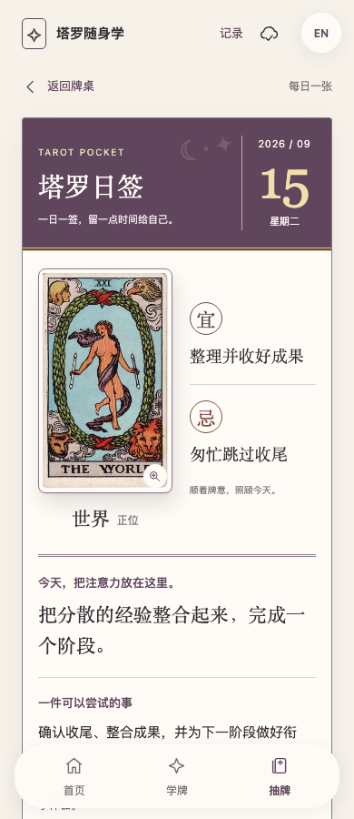
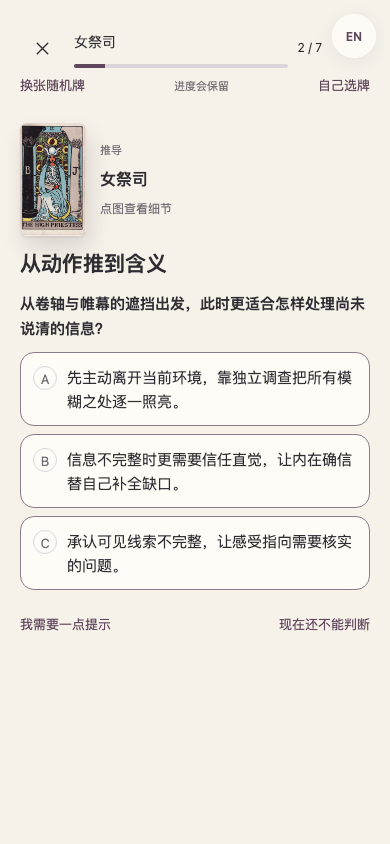
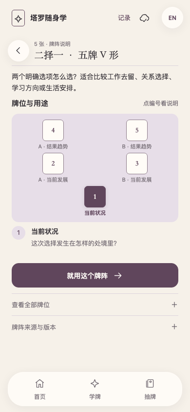
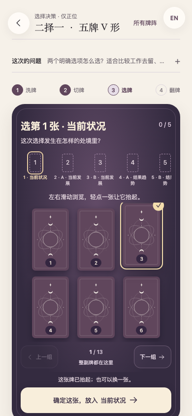
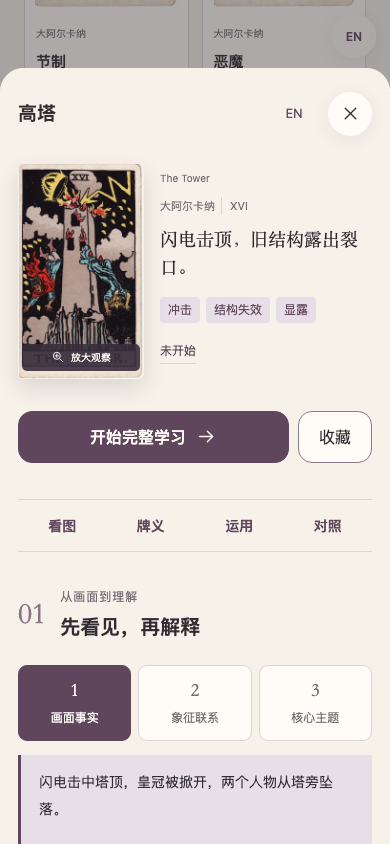

# Tarot Pocket · 塔罗随身学

**看到一张牌，记得它；读懂一张牌，知道为什么。**

一个以真实牌图为起点的双语塔罗学习空间。用点击完成回忆、辨析、找依据和解牌，把完整 78 张牌与当前课程装进一份离线 HTML，带在身边。

[**开始体验 →**](https://georgelu-creator.github.io/tarot-pocket/?lang=zh) · [**下载离线版**](https://github.com/georgelu-creator/tarot-pocket/releases/download/v1.5.4/tarot-pocket-v1.5.4.html) · [English](README.md) · [后续计划](docs/ROADMAP.md)


[](LICENSE)
[](CONTENT_LICENSE.md)

v1.5.4 提供 **自由选择 78 张牌的连续学习**、按能力安排的间隔复习，以及独立的随身牌桌。托管网页使用一次 8 位邀请码入口；进入后 AI 解牌自动连接服务端，并围绕用户的真实问题解读整组牌。

**已经用过旧版？** 请打开[保留记录更新](https://georgelu-creator.github.io/tarot-pocket/update.html?lang=zh)，选择“检查并下载新版”，完成后点“保留记录，进入新版”。无需清缓存或删除学习进度。

首页学牌与抽牌卡片保持对齐；洗牌清晰呈现摊开、打散交错、重新收拢。选牌支持左右滑动，轻点抬起、确认后入位，不再依赖翻页按钮。AI 解读等待时有轻柔动效和轮换观察提示，超过 25 秒会说明仍在等待；可随时取消，答案返回即展示。[查看洗牌与选牌操作录屏（1.5.2）](docs/images/ritual-v152.webm)。

## 给今天留一点仪式感

日签以日历手札呈现：突出日期与星期，完整牌图旁显示对应正逆位的 **宜／忌**，下方保留原有牌义与行动建议，并可展开画面依据、查看完整释义。轻柔入场动效支持「减少动态」。当天重开仍是同一张牌，历史日签显示原日期。这些是牌义启发的生活提醒，不是传统黄历的吉凶择日；没有分享步骤。



## 让一张牌，真正留在记忆里

只背“星币四＝抓紧不放”，很容易忘。这里会带你看清人物的手与脚，先在脑中回忆，再分辨接近的解释，联系土元素与数字四，最后把同一张牌放进不同牌位。

有明确判据的题，答错会指出所选解释错在哪里；开放的牌位应用先在心里解一句，再核对参考并自评。最后遮住牌图与线索，自己回忆；展开提示会记成辅助回忆。

首页点 **随机学一张**，优先遇见还没开始的牌；**接着上次**单独保留，也可以在 **学牌** 中自己挑选。每张牌都有观察、推导、理解、辨析、换位、逆位和回忆七个环节。完成后继续下一张；中途暂停、换牌、关闭网页，都保留对应进度。



## 现在就能使用

| 体验 | 当前版本 |
| --- | --- |
| 看真实牌图 | 同一套 Pam-A 历史 RWS 扫描，共 78 张；逐张保留来源与哈希 |
| 不止看图选名字 | 78 套七步连续学习，另保留 56 步进阶课程和 24 道快练题 |
| 建立理解框架 | 元素、数字、图像证据、相似牌辨析、换牌位与逆位情境 |
| 学会用牌阵 | 7 种有出处的牌阵结构与塔罗日运，紧凑展示用途和每个位置的含义 |
| 换个问题再理解 | 感情、事业、学业三个主题，同牌换情境、换角色 |
| 没带实体牌也能抽 | 问题可写可不写，完整 78 张随机洗牌、切牌、滑动选牌、无放回确认、逐张翻牌，可选正逆位 |
| 按表现复习 | 六项能力分别使用 SM-2 间隔规则；即时重做不会冒充隔天回忆 |
| 随时暂停和回来 | 本地进度、可续抽的牌桌、最近 40 组抽牌记录、JSON 导入导出 |
| 中英文切换 | 应用界面与学习内容均提供简体中文和英文 |

牌阵按**感情、工作、学业、生活、自我与选择**分类。每个牌阵先展示真实布局缩略图和全部位置，再进入洗牌、切牌与抽牌；另有每天保留同一张牌的**塔罗日运**。





## 为网络不稳定的旅途准备

手机推荐使用公开网页：

1. 用 Safari 打开 [Tarot Pocket](https://georgelu-creator.github.io/tarot-pocket/?lang=zh)。
2. 进入 **记录 → 检查离线内容与安装 → 下载离线内容**，保持页面打开直到完整校验通过。
3. Safari 分享菜单选择 **添加到主屏幕**。从主屏幕打开后，再检查一次离线状态。
4. 出发前在实际手机上开飞行模式，退出重开、查看陌生牌，并确认记录保留。

页面会显示真实下载与校验状态。更新未完成时保留旧版，不在学习中强制刷新。也可以下载 [单文件离线 HTML](https://github.com/georgelu-creator/tarot-pocket/releases/download/v1.5.4/tarot-pocket-v1.5.4.html)，用支持本地 JavaScript 的浏览器打开。

**网页内容和个人记录是两回事。** 浏览器可能清理网站数据；换设备或浏览器前，在记录页导出 JSON。Git 只同步源码，不上传私人问题和学习记录。学习、课程、图片和语言包均本地运行，无账号、外部字体或统计。主动选择 AI 解读时，仅发送本次问题与实际抽牌；密钥只在服务端配置。见 [AI 服务配置](docs/AI_SERVICE.md)。

## 能力与边界

- 全部 78 张牌都有专属画面助记、近似牌区别和三个接近的干扰项，并进入相同完整学习流程。
- 记录区分接触、完成初学、自评、客观应用与延迟回访；不是点一下“读过”就算掌握。
- 六项能力采用 SM-2 间隔规则，并加上最近作答不足 24 小时不晋级、失败后即时重做不清除待巩固的限制。不是 FSRS，也未宣称长期记忆效果已验证。
- 离线参考明确标为基础参考；可选 DeepSeek / OpenAI 服务结合问题和整组牌生成完整解读，保存后可以离线回看。报告不混入教学题。见[牌阵来源与版本](docs/SPREAD_SOURCES.md)。
- 课程、翻译与解释仍待独立塔罗教师审校；自动化校验不等于专业审核。真实 iPhone、重启与长时间离线仍需实机验证，具体测试证据见 [接力记录](docs/HANDOFF.md)。
- 当前交付是可安装的手机网页，不是 App Store 原生应用。

## 本地运行

准备 **Python 3.10+** 和 **Node.js 22+**。应用使用原生 HTML、CSS 和 JavaScript，Python 负责打包独立网页，Playwright 检查交互。

```sh
git clone https://github.com/georgelu-creator/tarot-pocket.git
cd tarot-pocket
python3 -m venv .venv
source .venv/bin/activate
python -m pip install -r requirements-dev.txt
npm ci
npx playwright install chromium webkit
npm run build
npm run serve
```

打开[本地 Demo](http://127.0.0.1:8765/demo/tarot-demo.html)。运行 `npm test` 执行项目检查。目录与开发流程见[开发指南](docs/DEVELOPMENT.md)，换电脑继续开发见[接力说明](docs/HANDOFF.md)。

## 一起来打磨下一堂课

最有帮助的反馈很具体：**哪张牌、哪个牌位、哪个选项，让你犹豫了，为什么？** 体验后可以[报告交互问题](https://github.com/georgelu-creator/tarot-pocket/issues/new?template=bug.yml)、[修订课程或翻译](https://github.com/georgelu-creator/tarot-pocket/issues/new?template=learning-content.yml)，也可以[提出功能建议](https://github.com/georgelu-creator/tarot-pocket/issues/new?template=feature.yml)。

欢迎学习者、塔罗教师、译者和无障碍体验者参与。提交 PR 前请阅读[贡献指南](CONTRIBUTING.md)，示例请使用虚构情境，不要公开私人抽牌记录。如果这种学习方式对你有帮助，欢迎点一颗 Star，让更多人发现它。

## 牌图与开源许可

牌图由 **Pamela Colman Smith** 绘制，使用历史 Rider–Waite–Smith **Pam-A** 版本的 [Wikimedia Commons TaionWC 扫描集合](https://commons.wikimedia.org/wiki/Category:Rider-Waite-Smith_tarot_deck_(TaionWC))。项目保留图片身份、来源、尺寸与哈希，不混入现代重绘或生成式替代图。

- **应用代码与工具：**[MIT](LICENSE)。
- **原创课程、翻译、文档与新设计牌背：**[CC BY-SA 4.0](CONTENT_LICENSE.md)。
- **历史牌图：**独立的[牌图权利说明](ARTWORK_LICENSE.md)、[来源说明](assets/SOURCES.md)和[逐牌清单](assets/manifest.json)。来源页标注公共领域；这与代码、课程的许可分别处理。

Tarot Pocket 是独立学习项目。[版本记录](CHANGELOG.md) · [安全问题](SECURITY.md) · [社区约定](CODE_OF_CONDUCT.md)
