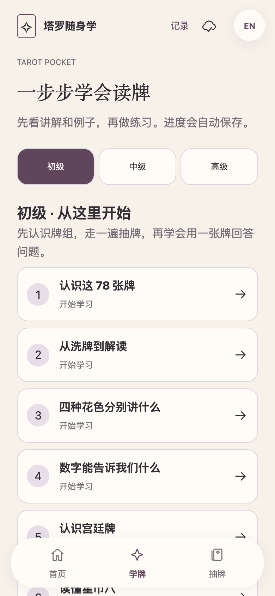
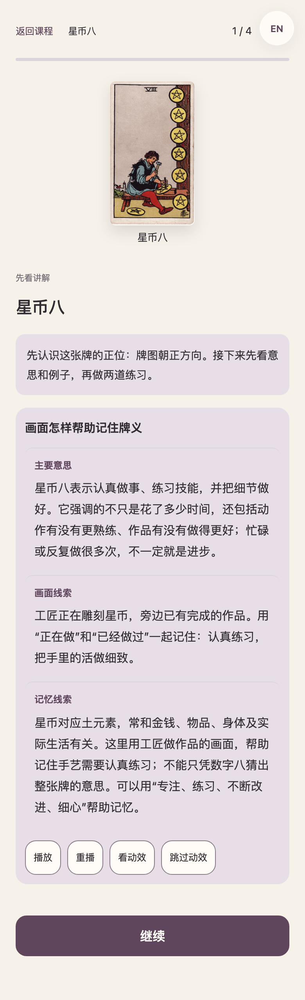
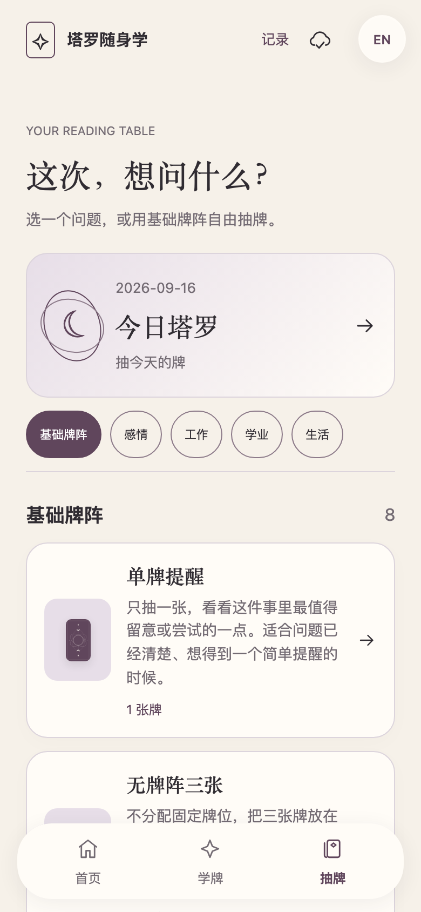
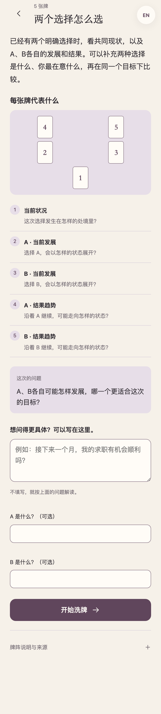
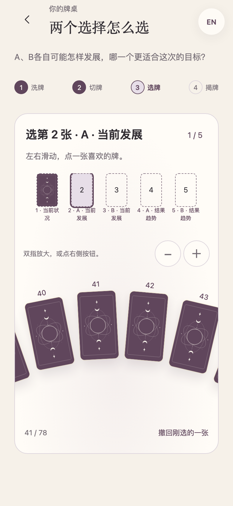
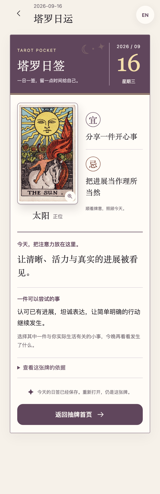

# Tarot Pocket · 塔罗随身学

**从零开始学塔罗，也可以带着问题来抽牌。**

[**手机体验 →**](https://tarot.georgelu.cn/) · [**离线版**](https://github.com/georgelu-creator/tarot-pocket/releases) · [English project notes](README.md)


## 一步步学会读牌

20课分为初级8课、中级6课、高级6课，另有独立的78张牌库与逐张学习。先看讲解、牌面线索和具体例子，再回答已经教过的内容。答错会说明错在哪里，换一个例子帮助理解；仍然困难时先总结、保存，再安排回访。

单张牌先学正位和情境应用，之后学习逆位。可以按课程走，也可以随机学新牌或自己选牌。牌图的位置与大小保持一致，不需要填写自评、感悟或语音，也不用操作播放按钮。讲解、例子和练习直接呈现。



## 直接找到想问的事情

25个场景按基础、感情、工作、学业、生活分组。单牌、自由三张在前，也有“能不能／会不会”、二选一、三选一、感情发展、复合、求职与考试。每个入口说明适合问什么、会回答什么；介绍页直接列出完整牌阵及所有牌位，不用逐个点开。

预设问题可以直接使用，想问得更具体再补充。洗牌、切牌和选牌在连续牌桌上完成；78张牌背可以滑动到达、缩放，一次轻点选入，不需要二次确认。默认包含逆位，一次揭开整组。



揭牌后先在本机围绕这次的问题、牌阵、牌位和正逆位给出完整解读；“能不能／会不会”不按正逆位机械投票，自由三张也不暗设时间线或建议牌。需要更深入时，再由用户明确点击联网AI入口。等待可以取消，重试保留原牌；修改问题后，迟到的旧回答不会覆盖新问题。

完整回答自动保存在本机。查看单牌、牌阵说明或返回时保留阅读位置。没有网络时仍可抽牌、看参考与已保存的回答；离线参考不会冒充AI答案。

## 每天的一张牌

日签突出日期与星期，保留完整牌图、牌义与建议，增加与正逆位含义对应的“宜／忌”。同一天再打开还是原来那张牌，可以回看往日记录；没有分享或签到任务。宜忌是牌义启发的日常提醒，不是传统黄历结论。



## 手机、中文与离线

- 托管网页公开进入，学习、抽牌和本地牌阵解读不需要账号或邀请码。供应商密钥始终留在服务端。
- 只有主动点击“请 AI 深度解析”才会建立短期匿名会话；连接失败不影响本地解读、牌面或问题。
- 在“记录 → 检查离线内容与安装”下载并校验完整内容，再通过Safari“添加到主屏幕”。断网前应在自己的手机测试一次。
- 本期公开界面只提供中文，避免未完成的英文内容干扰学习；底层稳定ID、旧记录和历史RWS牌图保持不变。
- 进度保存在当前浏览器。换设备前导出JSON；新版保留以前的学习与抽牌记录。更新时使用上面的手机入口，不必清空网站数据。

[教学主文档](docs/LEARNING_MASTER.md) · [抽牌主文档](docs/READING_MASTER.md) · [本版实现与验证](docs/RELEASE_1_9.md)

自动检查覆盖内容、状态恢复、中文界面、响应式和浏览器交互；尚不证明长期学习效果或真实手机在所有网络上的表现。独立教师审稿与新人试学仍需继续。

## 本地运行

准备 **Python 3.10+** 和 **Node.js 22+**。应用使用原生 HTML、CSS 和 JavaScript，Python 负责打包独立网页，Playwright 检查交互。

```sh
git clone https://github.com/georgelu-creator/tarot-pocket.git
cd tarot-pocket
python3 -m venv .venv
source .venv/bin/activate
python -m pip install -r requirements-dev.txt
npm ci
npx playwright install chromium webkit
npm run build
npm run serve
```

打开[本地 Demo](http://127.0.0.1:8765/demo/tarot-demo.html)。运行 `npm test` 执行项目检查。目录与开发流程见[开发指南](docs/DEVELOPMENT.md)，换电脑继续开发见[接力说明](docs/HANDOFF.md)。

## 一起来打磨下一堂课

最有帮助的反馈很具体：**哪张牌、哪个牌位、哪个选项，让你犹豫了，为什么？** 体验后可以[报告交互问题](https://github.com/georgelu-creator/tarot-pocket/issues/new?template=bug.yml)、[修订课程或翻译](https://github.com/georgelu-creator/tarot-pocket/issues/new?template=learning-content.yml)，也可以[提出功能建议](https://github.com/georgelu-creator/tarot-pocket/issues/new?template=feature.yml)。

欢迎学习者、塔罗教师、译者和无障碍体验者参与。提交 PR 前请阅读[贡献指南](CONTRIBUTING.md)，示例请使用虚构情境，不要公开私人抽牌记录。如果这种学习方式对你有帮助，欢迎点一颗 Star，让更多人发现它。

## 牌图与开源许可

牌图由 **Pamela Colman Smith** 绘制，使用历史 Rider–Waite–Smith **Pam-A** 版本的 [Wikimedia Commons TaionWC 扫描集合](https://commons.wikimedia.org/wiki/Category:Rider-Waite-Smith_tarot_deck_(TaionWC))。项目保留图片身份、来源、尺寸与哈希，不混入现代重绘或生成式替代图。

- **应用代码与工具：**[MIT](LICENSE)。
- **原创课程、翻译、文档与新设计牌背：**[CC BY-SA 4.0](CONTENT_LICENSE.md)。
- **历史牌图：**独立的[牌图权利说明](ARTWORK_LICENSE.md)、[来源说明](assets/SOURCES.md)和[逐牌清单](assets/manifest.json)。来源页标注公共领域；这与代码、课程的许可分别处理。

Tarot Pocket 是独立学习项目。[版本记录](CHANGELOG.md) · [安全问题](SECURITY.md) · [社区约定](CODE_OF_CONDUCT.md)
