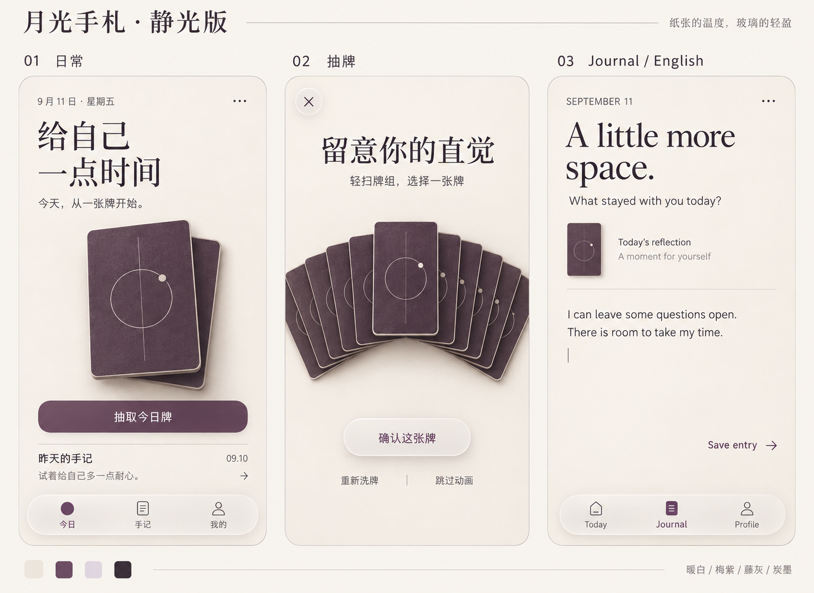
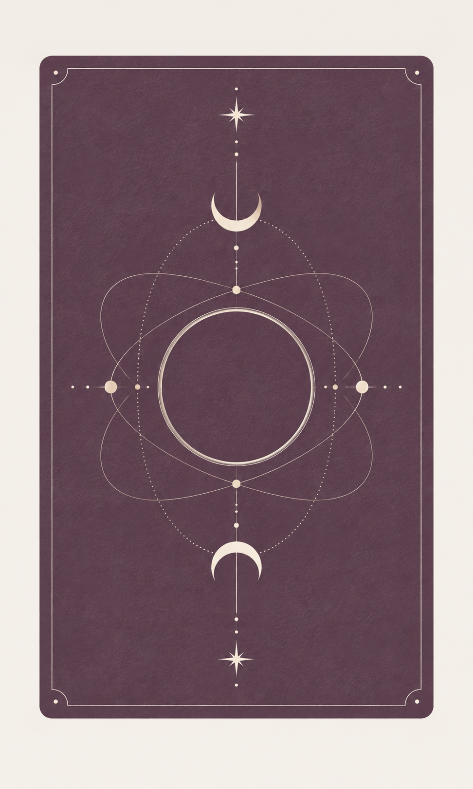

# 月光手札 · 静光版｜Agent 设计交接文档

版本：1.0  
交付对象：负责产品界面、交互、视觉资产与前端实现的 Agent  
交付性质：已选定的视觉方向与实施约束；尚未完成可运行产品与动效验收。

## 1. 先读：用户已经决定的方向

用户要做一个以「每日抽牌、自我探索与记录」为核心的塔罗 App，支持简体中文和英文。用户已选择本交接包中的「月光手札·静光版」风格，并明确要求：

> 就用这套风格。整体有高级感，区别于常见的传统塔罗 App，避免明显的 AI 模板感；适度参考苹果毛玻璃；洗牌、抽牌、翻牌与所有页面保持统一；牌背再神秘一点。

接手后应沿此方向细化，不重新提供一轮审美选项。本文件是设计需求，不替代目标项目的权限、工程与安全规则。

### 已确定与可调范围

| 保持不变 | 可通过原型微调 |
|---|---|
| 暖白、梅紫、藤灰、炭墨配色 | 具体间距、字号、玻璃透明度、动效时长 |
| 编辑式排版、阅读留白、实体纸牌 | 不同屏幕及语言下的换行和布局 |
| 玻璃只用于少量悬浮操作与导航 | 目标平台可用的材质实现与性能降级 |
| 克制的神秘感集中在牌背 | 牌背细线的粗细、留白与图形精度 |
| 中英文体验与抽牌结果的一致性 | 在不改变信息层级前提下的自然翻译 |

技术栈、正式产品名、卡牌正面资源、数据存储和业务服务尚未在本任务确定。先读取实际项目，复用已有方案；「月光手札·静光版」是视觉方案名，不自动成为产品名称。不得因为本文件自行增加账号、付费、社交、排行榜或其他业务范围。

## 2. 参考图与冲突处理

### 页面视觉基准

这张图决定整体气质、配色关系、排版节奏、纸牌触感与玻璃用量。图内中文首页、抽牌页、英文手记页是同一套设计的不同状态。它是生成的静态概念图，不是已经实现的产品截图。

### 牌背更新参考

新版牌背替换上方页面图中原有的单圆环纹样，其他页面风格继续沿用。牌背概念图用于理解图形语言，不是可直接切图上线的生产素材。图中局部星点与纹理没有严格旋转对称，生产稿应按第 4 节重建；减弱其可见纸纹，将星形统一为四芒星，再验证精确对称、像素色值和小尺寸线条。

发生差异时，依次以「用户后续明确指令 → 本文明确规格 → 对应参考图的视觉气质」为准。不要照抄生成图中的偶然纹理、非标准图标、文字误差、过度阴影或裁切。页面图中的日期、牌组数量、手记内容只是占位示例。

## 3. 视觉系统

### 3.1 设计意图

目标感受：安静、精致、有触感、略带神秘，适合长期阅读和私人记录。

识别度来自四处：梅紫与暖白的比例、宋体和衬线标题、纸牌的物理连续性、牌背的月蚀与星轨。大面积空间保持平静，把细节集中在用户正在触摸的对象上。

### 3.2 配色与角色

以下名称是设计语义，接手 Agent 应映射到项目已有样式系统，不代表仓库里已存在这些配置。

| 设计角色 | 色值 | 使用规则 |
|---|---|---|
| 页面背景／暖白 | `#F6F1E9` | 全局背景、阅读与书写区域 |
| 主强调／梅紫 | `#60465C` | 主按钮、选中状态、牌背主色 |
| 辅助底色／藤灰 | `#E7DEE8` | 少量提示、弱分组；不作浅底上的正文色 |
| 主要文字／炭墨 | `#302C32` | 标题、正文、重要图标 |
| 次要文字 | `#736B73` | 日期、辅助说明；关键动作不用低对比灰字 |
| 分隔线 | `#DCD4DC` | 轻量内容分区；不勾勒每一个区块 |

后两种是本交接文档补充的中性实施值，不新增品牌强调色。主按钮用梅紫底与暖白字。颜色以 HEX 为准，不从生成图采样反推。透明表面的文字应在真实背景上复核，纯色对比度不能代替玻璃叠加后的检查。普通文本以至少 4.5:1、较大文本和关键控件边界以适用的 3:1 要求作为本项目验收目标。

首版视觉基准为浅色。若实际项目已有深色模式，应保留并使用同一梅紫色系与材质逻辑；本文件不授权另行增加黑金、霓虹等独立主题。

### 3.3 三种材质，各有职责

| 层级 | 材质 | 出现位置 |
|---|---|---|
| 环境 | 暖白哑光底色 | 页面背景和连续阅读区域 |
| 内容 | 不透明表面、实体纸牌 | 牌面、解读、手记、输入内容 |
| 操作 | 适量乳白磨砂玻璃 | 悬浮导航、关闭按钮、临时确认控件 |

玻璃应有轻微透色、细薄亮边与柔和阴影，不做玻璃叠玻璃。阅读段落、输入区和牌面不透明；普通主按钮仍为实体梅紫色。

原生 iOS 优先复用可用的系统材质与标准组件。其他平台用自身能力表达相同层级，不宣称普通背景模糊等同于原生 Liquid Glass。模糊数值与透明度在实际平台调试，不将示意图当成固定滤镜参数。

开启减少透明度、增强对比度或设备无法稳定渲染时，控件转为更实的暖白表面，仍保留清晰边界和操作层级。禁止因为性能降级让操作消失。

### 3.4 字体、比例与空间

| 内容 | 中文 | 英文 | 起始尺寸 |
|---|---|---|---|
| 首页展示标题 | 思源宋体 Medium | Noto Serif Medium | 32–36 |
| 页面标题 | 同上 | 同上 | 28–32 |
| 正文 | 系统无衬线；中文用苹方或思源黑体回退 | 系统无衬线 | 16–17 |
| 按钮 | 系统无衬线、中等字重 | 同左 | 16–17 |
| 辅助与导航 | 系统无衬线 | 同左 | 12–14 |

尺寸以逻辑单位表达：iOS 使用 pt，Web 以 CSS px 为起点并支持字体缩放。字体是设计选型；接手方应核对可用字体、字重与分发条件，缺失时使用上述同类回退，不阻塞正文呈现。不得为凑效果擅自引入无关字体服务。

中文正文行高约 1.65，英文约 1.5；按实际字形微调。中文不加英文式大字距；英文不大面积全大写。衬线只承担展示标题，不铺满表单、按钮和正文。高级感不靠极细字重、小字或低对比度建立。

推荐间距阶梯：4／8／12／16／24／32／48。手机页面边距从 24 开始，窄屏可减至 20。主要控件高约 48–52，触摸区域至少 44×44 逻辑单位。普通按钮圆角约 14，内容容器约 16–20；悬浮导航可用胶囊。牌的圆角更小，不把所有对象都做成同一种大圆角盒子。

图标使用项目已有的单一系统，统一线宽与光学大小。功能图标与牌背装饰分开。留白和分隔线承担大部分内容组织，避免每段文字都套一个容器。

## 4. 牌背：月蚀星轨

### 4.1 要达到的变化

保留静光版梅紫纸牌的质感，将原本过于简单的圆环升级为「安静的天体印记」。神秘感集中在图形的秩序与细节，不扩大为全页面特效。

### 4.2 可执行构图

- 底色：梅紫 `#60465C`，哑光、均匀。微纹理仅可近看感知，不使用布料、皮革、旧纸污渍或显著噪点。
- 主体：居中的细线月蚀圆环，中央保留空白梅紫区域。
- 层次：两至三条有秩序的轨道线与圆环交叠；月牙成对布置，上下互为旋转对应。
- 点缀：上下各一枚小四芒星，再配极少量成对星点。中心主体强于次要轨道，外围星点最弱。
- 线色：暖白；用线粗与不透明度分层，不额外增加金色、彩虹光或发光描边。
- 边界：可保留一条细内框；纹样到裁切边至少留卡宽的 6%，给呼吸空间。
- 留白：以约一半卡面保持安静为起点，避免把所有空位填满。

### 4.3 必须满足的资产约束

1. 印刷纹样旋转 180° 后应严格一致，包括星点、月牙、边框、纹理与任何标记，避免从牌背判断正逆位。仅左右对称不够。
2. 不加名称、数字、方向字样、非对称 Logo。所有牌使用同一份牌背资产，不为不同牌生成微小差异。
3. 标准组件比例以宽高 3:5 为起点。真实牌面资源若比例不同，应完整适配并保留图像，不裁掉关键图像或把牌面拉伸。
4. 纸牌的厚度、倒角、投影由组件统一负责，不烘焙进印刷纹样。上方光源属于场景光照，不能成为资产固有的方向标记。
5. 小尺寸以约 80–120 逻辑单位宽测试：中心印记应仍可辨认，细线不出现闪烁、摩尔纹或挤成一团。
6. 本包 PNG 是概念参考。生产纹样应重建为精确几何资产，例如 SVG 或工程适合的矢量路径，再按需导出栅格；检查原始印刷区域与其 180° 旋转版本的差异。不要把生成图的随机纹理当作通过对称验收。
7. 正面牌组另行接入用户提供或已确认可用的资源。不得把本概念图当作维特原牌，也不在没有要求时重绘整副牌。

## 5. 页面与组件

### 首页

小日期 → 一句有留白的展示标题 → 作为主视觉的纸牌／牌组 → 一个抽牌主动作 → 最近手记 → 悬浮导航。

保留参考图中「给自己／一点时间」的节奏，但不硬编码断行到所有设备。主牌轻微倾斜即可；不持续漂浮。历史记录可用细分隔线和一行摘要组织。若当天已有牌，呈现「查看今日牌」等对应状态，不以原型占位文案决定重复抽牌业务规则。

### 洗牌与选牌

进入专注页面后收起持久底部导航，保留退出操作与简短引导。牌组可交错归拢，再展开为浅弧扇形或平台适合的可滑动牌组；只有当前候选牌抬起。

参考图中的九张牌是展示窗口，不代表牌库只有九张。扇形位置不是牌义、牌种或正逆位提示。不实现可观察的外观差异来暗示结果。

触摸滑动之外提供可点选／聚焦的等价选择方式。小屏时保持操作控件完整可见；不靠裁掉退出或确认按钮给牌组腾位置。

### 揭牌与解读

被选牌连续移动到中心，翻面后完整显示真实牌图；牌稳定后再出现牌名、正逆位状态（如产品启用）和解读。长文分段，不覆盖在图像或玻璃上。保留明确的「写下感受」入口。

### 手记

日期、轻量牌面线索、用户文字是主要内容。书写区域使用不透明背景和自然留白，输入焦点不使用夸张发光。键盘弹起后，输入位置与保存操作可见。保存中、失败重试与成功反馈使用同一套字体、颜色和间距。

### 共用组件

优先统一颜色与字体角色、卡牌、牌组、主按钮、玻璃操作控件、导航、阅读段落、手记输入区。各页面复用同一套组件。玻璃是材质变体，不新建另一套视觉主题。

## 6. 动效与抽牌状态

### 6.1 一致的物理规则

轻、有重量、短距离、稳定停止。卡牌连续复用相同对象与身份；厚度、圆角、图案、光源和投影不会在洗牌、选牌、抽出与翻牌之间跳变。

场景光源统一来自左上方。牌抬高时投影变软、距离增加；放下时收紧。背景装饰不抢动效焦点；不使用持续呼吸、粒子爆炸、星光拖尾或反复弹跳。

### 6.2 动效参数起点

以下为设计提议，不是平台官方指定数值。先做一轮可运行原型，再依据手感和设备表现微调。

| 动作 | 行为 | 起始时长 |
|---|---|---|
| 按钮按下／恢复 | 约 0.98 倍缩放或平台标准反馈 | 120–160 ms |
| 洗牌 | 分叠、交错、归拢，展开后停稳 | 800–1200 ms |
| 滑动与候选变化 | 跟随手势；候选牌抬起约 8–12 逻辑单位 | 跟手；离手后短暂收稳 |
| 确认抽出 | 当前牌向中心移动，其余牌退开 | 300–400 ms |
| 翻面 | 以竖轴翻转，正背面切换连续 | 550–700 ms |
| 解读出现 | 牌稳定后轻微淡入 | 180–240 ms |
| 页面切换 | 使用平台一致的短过渡 | 180–240 ms |

运动缓动采用一套平滑减速规则，直接操作阶段跟手；弹簧仅用于短促收稳，避免可见的反复震荡。Web 如需起点，可从 `cubic-bezier(0.22, 1, 0.36, 1)` 评估非跟手的位移；这是建议参数，不是已有项目配置。

### 6.3 结果与动画分离

- 接入实际项目的抽牌规则。动画不能决定牌库范围、随机算法、每日次数、正逆位概率或持久化方式。
- 同一次抽牌结果一旦由业务层确定，跳过、重播、恢复与语言切换均不得重抽。
- 「重新洗牌」在结果确认前是允许的交互入口；若产品已有不同语义，先遵循实际规则。结果确认后不保留含义模糊的重洗入口。
- 防止连续点击在过渡中创建多个结果或多份保存。允许取消、跳过或退出，不用强制长动画锁住用户。
- 内容加载等待使用安静的状态说明；不要通过无限重复洗牌掩盖网络等待。
- 触觉反馈仅在候选变更、确认等关键节点触发，不随每一帧触发；可用的轻声音应可关闭，缺少音效资源不临时添加嘈杂素材。

### 6.4 减少动态与性能

跟随系统「减少动态」。启用时取消 3D 翻面、大范围扇形移动、视差和反复洗牌，以约 120–180 ms 淡入与状态文字完成同一次结果呈现。

目标是在可支持设备上保持流畅；先减少同时运动的牌数、模糊区域和动态阴影，再考虑增加依赖。材质或特效降级不能改变结果、遮挡操作或牺牲文字可读性。没有真机或低性能设备验证时，明确报告未验证范围。

## 7. 中英文与内容规则

首版按简体中文与英文设计。首次跟随系统语言；未支持的系统语言回退英文。设置提供「跟随系统／简体中文／English」，沿项目已有偏好存储方式保存选择，不擅自新建后端。

所有界面文案集中管理，包括按钮、日期、提示、空状态、错误、无障碍标签和牌名。每页只呈现当前语言。中文与英文分别自然表达，允许不同换行、行高和按钮宽度，不靠缩小字体容纳翻译。

语言切换保留当前页面、抽牌结果、焦点和未提交输入。用户手记保留原文，不随界面语言自动翻译。牌名与牌义使用一份统一对应表；牌面图像内的文字属于素材内容，不是普通界面文案。

| 中文基准 | 英文基准 |
|---|---|
| 给自己一点时间 | Take a moment for yourself |
| 今天，从一张牌开始。 | Begin your day with a card. |
| 抽取今日牌 | Draw today's card |
| 留意你的直觉 | Follow your intuition |
| 轻扫牌组，选择一张牌 | Swipe through the deck and choose a card |
| 确认这张牌 | Choose this card |
| 重新洗牌 | Shuffle again |
| 跳过动画 | Skip animation |
| 写下你的第一感受 | Capture your first impressions |
| 保存手记 | Save entry |
| 今日／手记／我的 | Today / Journal / Profile |

语气温柔、简洁、邀请式。强调观察和个人感受，不写成决定命运、保证结果或替用户作决定的宣判。具体牌义文案需独立核对，不从视觉示例复制成正式解读。

## 8. 接手 Agent 的实施与验收

### 实施顺序

1. 阅读实际项目与已有规则，确认可用页面、技术栈、字体、牌面资源和业务行为；记录会影响实施的缺口。
2. 统一基础样式和卡牌组件，按本文重建「月蚀星轨」牌背。
3. 完成首页、抽牌、解读、手记的同一套界面，同时适配两种语言。
4. 接入已有结果与记录逻辑，再连接洗牌、选牌和翻牌动效；保证跳过与重播结果一致。
5. 集中进行视觉、交互与相关工程验证。只针对实际缺陷迭代，不重复进行无关设计发散。

### 验收清单

- [ ] 页面整体与界面参考图的色彩关系、留白和材质一致；牌背使用新版纹样。
- [ ] 颜色、字体、间距、卡牌和动效共用规则，未出现页面各自配色和玻璃泛滥。
- [ ] 精确牌背纹样与 180° 旋转版本一致，且所有牌复用同一资产。
- [ ] 牌图完整，缩小后纹样清楚，翻牌时正背面没有穿帮或方向线索泄露。
- [ ] 提供中文和英文的首页、抽牌、解读及手记视图证据。
- [ ] 检查最窄支持屏幕、较大系统字号和键盘弹起状态，无关键内容被裁切。
- [ ] 真实背景上的玻璃文字和按钮可读；减少透明度后仍保持层级。
- [ ] 洗牌、选牌、确认、翻牌、阅读连续自然；提供一次屏幕录制或可运行演示作为动效证据。
- [ ] 检查跳过、重播、快速连点、退出恢复、语言切换，结果不被动画重新生成，输入不丢失。
- [ ] 减少动态时提供等价操作和相同结果；选择不只依赖滑动手势。
- [ ] 保存及加载的成功、等待、失败状态保持同一风格，不暴露临时技术占位信息。
- [ ] 运行项目中与修改相关的真实检查；无真实运行证据的部分明确列为待验证。

### 不接受的偏离

大面积黑金或蓝紫渐变、发光球、满屏星空、密集占星符号、繁复植物金边、每块内容都套毛玻璃、到处漂浮与弹跳、难读的细小灰字、把占位图当生产资产、只交静态截图却声称动效完成。

### 交付时说明

报告实际完成的页面、素材、语言和状态；列出相关验证结果及未验证范围。不要把文件存在、构建通过、截图生成或视频录制当作全部交互已验收。设计参数可以微调，但需要说明具体问题与调整理由，保持本文已确定的视觉方向。

## 9. 依据与交付状态

设计依据为本次对话已选定的静光版方案，以及用户最新要求的「牌背神秘一点」。玻璃分层与减少动态的原则参考 [Apple HIG：Materials](https://developer.apple.com/design/human-interface-guidelines/materials) 和 [Apple HIG：Motion](https://developer.apple.com/design/human-interface-guidelines/motion)。本文的配色、字号、间距和秒数属于本项目设计提议，不是 Apple 官方指定参数。

本交接包包含：

- `DESIGN.md`：本文件，交接主入口。
- `references/interface-reference.png`：用户已选定的页面风格参考。
- `references/card-back-concept.png`：新增的神秘牌背概念参考。
- `references/card-back-prompt.txt`：内置 imagegen 使用的完整提示词，供复现与继续精修。

当前仅完成设计文档与静态参考材料，未修改目标 App、未验证实际动画、未创建生产牌背资产、未发布或部署。

牌背概念通过内置 imagegen 基于页面参考生成。提示概要：保持暖白与梅紫、哑光纸感；生成单张正视牌背；以月蚀圆环、两至三条星轨、上下成对月牙和少量四芒星构成克制的天体印记；暖白细线；要求完整纹样 180° 旋转对称；无文字、金色、霓虹、繁复花纹与方向光影。生成图的精确对称性仍需在生产资产中重建验证。
